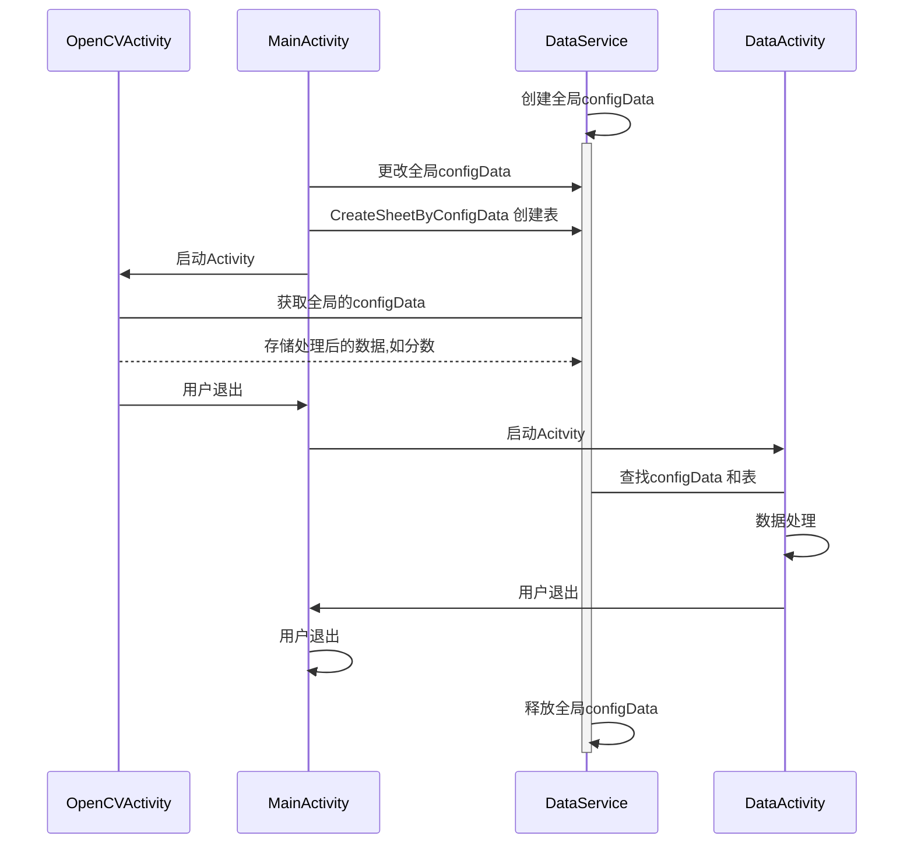

# 一级标题
## 二级标题
### 三级标题
#### Mermaid
mermaid:



链接: [github](https://github.com)

图片: 

代码块:

```c++
#include <iostream>
  
using namespace std;

typedef unsigned int uint;

int main(int argc,char** argv){

    for(uint c = 0; c < argc; c++){
        printf("%s\t", *(argv + c));
    }
    return 0;
}
```

latex公式:
$$S_N(x)= \sum_{n=-N}^{n=N} C_n\cdot e^{i\frac{2\pi nx}{P}}$$
